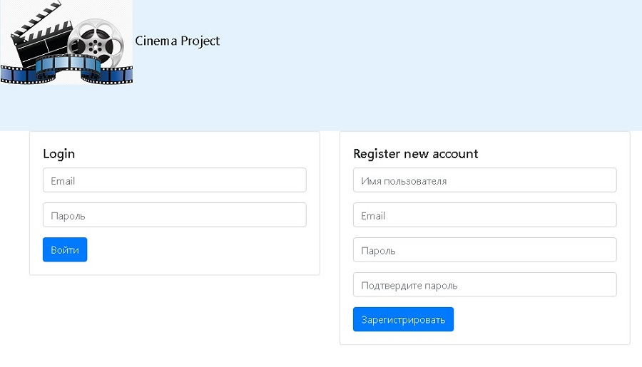
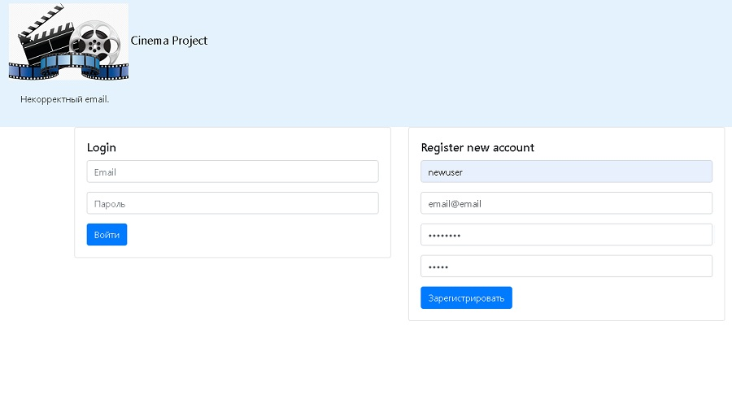
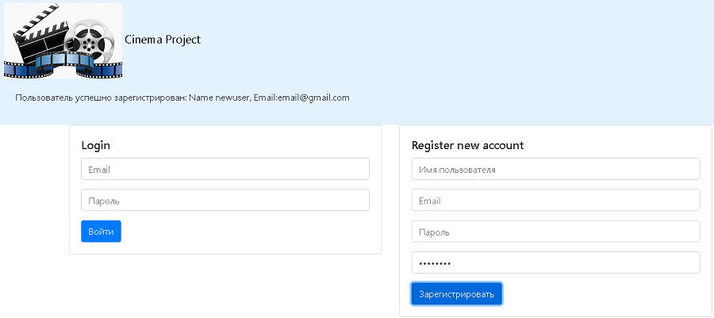
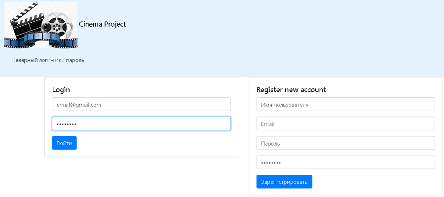
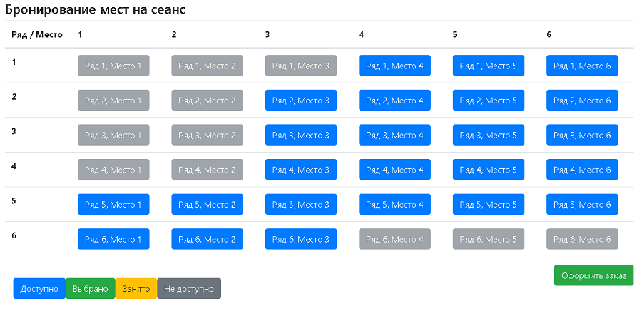
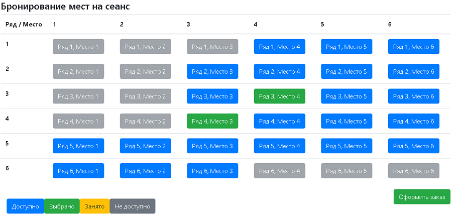
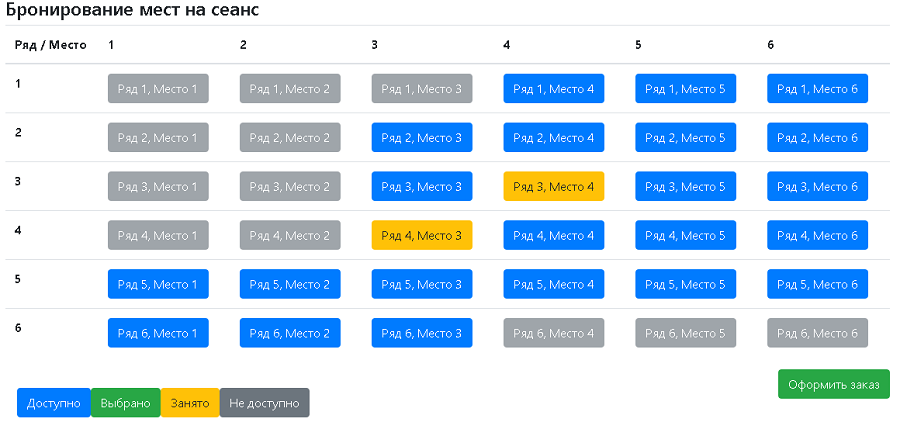
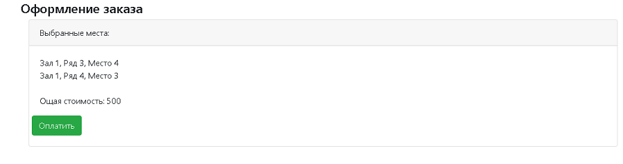
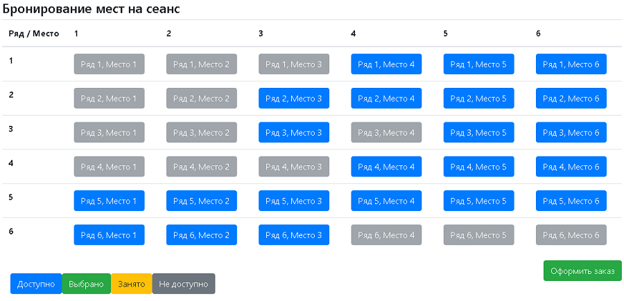

[GIT REPOSITORY](https://github.com/i3acsi/job4j_cinema.git)

Проект  Сервис - Кинотеатр.
 
веб сайт для покупки билетов в кинотеатр.

В системе представлны следующие модели:
 
 + пользователи
    + роли
 + места
- - -

При посещении главной страницы, в системе можно залогиниться или зарегистрироваться: 
 

 
 

 
 На странице есть валидация введенных данных:
  
 пароли - по длинне и по эквивалентности (при регистрации),
  
 email - по regexp,
  
 имя - по длинне
  
 
 
 

 
 

 
 При успешной регистрации нового пользователя, информация об этом отобразится на странице.
  
 Если произошла ошибка регистрации (например пользователь с таким email уже есть в системе),
  
 информация об этом так же отобразится.
  
    
  
  

  
  

 
  При попытке залогиниться в системе (как и при регистрации), на сервер отправляется асинхронный запрос.
   
  Дальнейшее поведение зависит от ответа сервера.
   
  Напимер, если пользователь с введеной парой email-password не найден, информация об этом отобразится.
   
      
  
  

  
  

   
  Если введеные данные верны, у сесси устанавливается аттрибут user - для корректной работы фильта,
   
  и со станицы приветствия, пользователь перенаправляется на страицу кинозала с местами.
   
  Места отобразятся цветом, в соответствии со своим статусом.
   
  Подсказка по статусам есть на странице
   
      
 
  
 Когда на соответствующий сервлет приходит get запрос для получения информации о местах,
  
 на базу данных приходит запрос по состоянию мест для этого зала, и на основании ответа,
  
 формируется ConcurrentHashMap, мапа буферизует текущее состояние мест зала 
  
 (т.к. оно меняется только при покупке соответствующих мест).
  
 Мапа хранит состояние selected, bought, account_id
  
 т.е., если у места состояние bought - оно не доступно, если состояние selected,
  
 его может сделать unselected или bought только пользователь с соответствующим account_id.
   
 Для более удобной работы с данными на странице, в ответе от сервера использую DTO.
   
 Т.е. данные из мапы преобразую в лист DTO, который затем преобразуется в json.
   

 

  
 

  
 При выборе мест, они становятся зеленого цвета
  
 

  
 При этом у другого пользователя, в этот момент осуществляющего выбор мест, эти места становятся желтыми, 
  
(не доступными для выбора в данный момент)
  
 

 Это сделано спомощью window.setInterval() к которой привязана функция обновления отображения мест - updateTable(). 
  
 updateTable() делает асинхронный запрос на сервер, он на осовании мапы в ответ отправляет json
  
 и распарсив json, функция формирует html код, который размещает на странице.
  
 сама же мапа сверяется с БД только если кто-то совершил покупку.
  
 

 
 Когда все нужные места выбраны, нажимаем - "оформить заказ".
  
 На сервер отправляется асинхронный запрос с id клиента и номером зала, в ответ мы получаем
  
 лист интовых массивов, котроый мы интерпретируем как список мест (ряд/место) и их цену.
  
 На основании полученных данных, выводим информацию о покупаемых местах с итоговой суммой.
  
 
    
 
 

 
 

   
  Нажав "оплатить", мы опять отправляем на сервер асинхронный запрос с id клиента и номером зала,
   
  но в этот раз мы осуществляем покупку.
   
  Все запросы на эти действия приходят на один сервлет методу post,
   
  но для каждого действия, в параметрах метода, передается определенный action.
   
  В соответствии с переданным параметром action, сервлет делает нужное нам действие.
   
  В данном случае, при покупке, мы опять обходим мапу, чтобы определить выбранные пользователем места,
   
  чтобы затем сделать запрос в БД, и пометить эти мета как купленные, обновить состояние
   
  мапы в соответствии с данными в БД.
   
     
  
  

 
 ---
  Используемые технологии:
 1. Apache Tomcat — контейнер сервлетов
 2. Java servlets, MVC
 3. JSP
 4. HTML, CSS, JS, Bootstrap, jquery ajax
 5. PostgreSQL, Lombok 
 6. Git, Travis CI, CodeCov